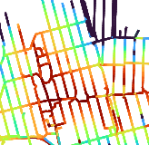
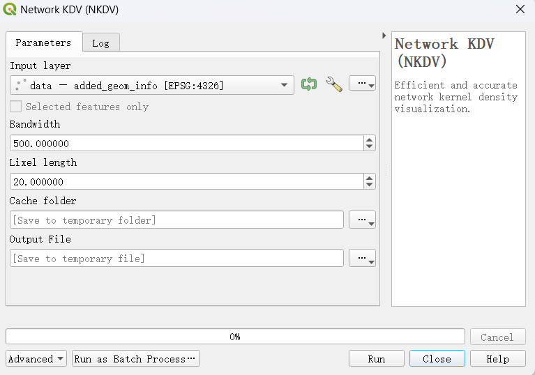
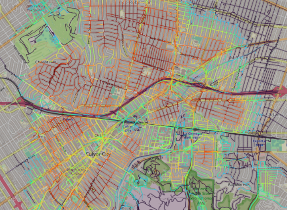

# Fast Density Analysis

A Powerful QGIS plug-in for Large-scale Geospatial Analytics

Unlock the power of large-scale geospatial analysis - with our QGIS plugin, quickly generate high-resolution kernel density visualizations, supporting advanced analysis tasks such as bandwidth-tuning and spatiotemporal analysis. No matter how large your dataset, our plugin delivers efficient and accurate results. Download now and start a new chapter in your geospatial analysis journey!

Power by 

- [LibKDV](https://github.com/libkdv/libkdv) - The fastest KDV library in the world.

- [PyNKDV](https://github.com/edisonchan2013928/PyNKDV) - The fastest NKDV library in the world

## Kernel Density Visualization(KDV)

Efficient and accurate kernel density visualization.

Result heatmap:

## Spatiotemporal KDV(STKDV)

Efficient and accurate spatiotemporal kernel density visualization.

Result Spatiotemporal heatmaps:

## Network KDV(NKDV)

Efficient and accurate network kernel density visualization.

Result Network heatmaps:

## Project Members:

[Prof. (Edison) Tsz Nam Chan](https://www.comp.hkbu.edu.hk/~edisonchan/), Hong Kong Baptist University

Mr. Bojian Zhu, Xidian University (now in Hong Kong Baptist University)

Mr. Rui Zang, Hong Kong Baptist University

[Prof. (Ryan) Leong Hou U](https://www.fst.um.edu.mo/personal/ryanlhu/), University of Macau

[Prof. Jianliang Xu](https://www.comp.hkbu.edu.hk/~xujl/), Hong Kong Baptist University

## Publications:

1. Tsz Nam Chan, Rui Zang, Pak Lon Ip, Leong Hou U, Jianliang Xu. PyNKDV: An Efficient Network Kernel Density Visualization Library for Geospatial Analytic Systems. Proceedings of ACM Conference on Management of Data (SIGMOD), 2023.
2. Tsz Nam Chan, Leong Hou U, Byron Choi, Jianliang Xu, Reynold Cheng. Large-scale Geospatial Analytics: Problems, Challenges, and Opportunities. Proceedings of ACM Conference on Management of Data (SIGMOD), 2023.
3. Tsz Nam Chan, Leong Hou U, Byron Choi, Jianliang Xu, Reynold Cheng. Kernel Density Visualization for Big Geospatial Data: Algorithms and Applications. IEEE International Conference on Mobile Data Management (MDM), 2023.
4. Tsz Nam Chan, Leong Hou U, Byron Choi, Jianliang Xu. SLAM: Efficient Sweep Line Algorithms for Kernel Density Visualization. Proceedings of ACM Conference on Management of Data (SIGMOD), 2022.
5. Tsz Nam Chan, Pak Lon Ip, Kaiyan Zhao, Leong Hou U, Byron Choi, Jianliang Xu. LIBKDV: A Versatile Kernel Density Visualization Library for Geospatial Analytics. Proceedings of the VLDB Endowment (PVLDB), 2022.
6. Tsz Nam Chan, Pak Lon Ip, Leong Hou U, Byron Choi, Jianliang Xu. SWS: A Complexity-Optimized Solution for Spatial-Temporal Kernel Density Visualization. Proceedings of the VLDB Endowment (PVLDB), 2022.
7. Tsz Nam Chan, Pak Lon Ip, Leong Hou U, Byron Choi, Jianliang Xu. SAFE: A Share-and-Aggregate Bandwidth Exploration Framework for Kernel Density Visualization. Proceedings of the VLDB Endowment (PVLDB), 2022.
8. Tsz Nam Chan, Zhe Li, Leong Hou U, Jianliang Xu, Reynold Cheng. Fast Augmentation Algorithms for Network Kernel Density Visualization. Proceedings of the VLDB Endowment (PVLDB), 2021.
9. Tsz Nam Chan, Pak Lon Ip, Leong Hou U, Weng Hou Tong, Shivansh Mittal, Ye Li, Reynold Cheng. KDV-Explorer: A Near Real-Time Kernel Density Visualization System for Spatial Analysis. Proceedings of the VLDB Endowment (PVLDB), 2021.
10. Tsz Nam Chan, Reynold Cheng, Man Lung Yiu. QUAD: Quadratic-Bound-based Kernel Density Visualization. Proceedings of ACM Conference on Management of Data (SIGMOD), 2020.
11. Tsz Nam Chan, Leong Hou U, Reynold Cheng, Man Lung Yiu, Shivansh Mittal. Efficient Algorithms for Kernel Aggregation Queries. IEEE Transactions on Knowledge and Data Engineering (TKDE).
12. Tsz Nam Chan, Man Lung Yiu, Leong Hou U. KARL: Fast Kernel Aggregation Queries. IEEE International Conference on Data Engineering (ICDE), 2019.
