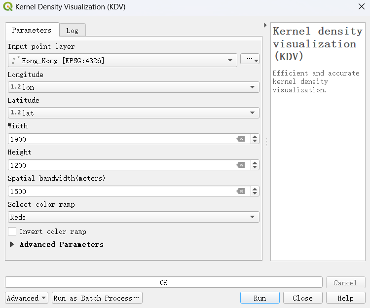
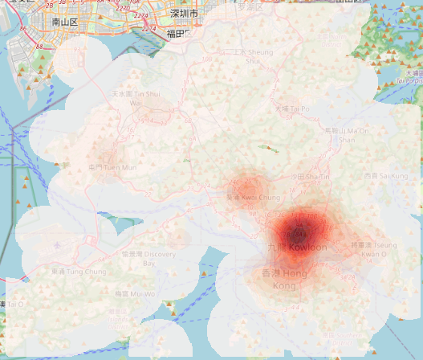
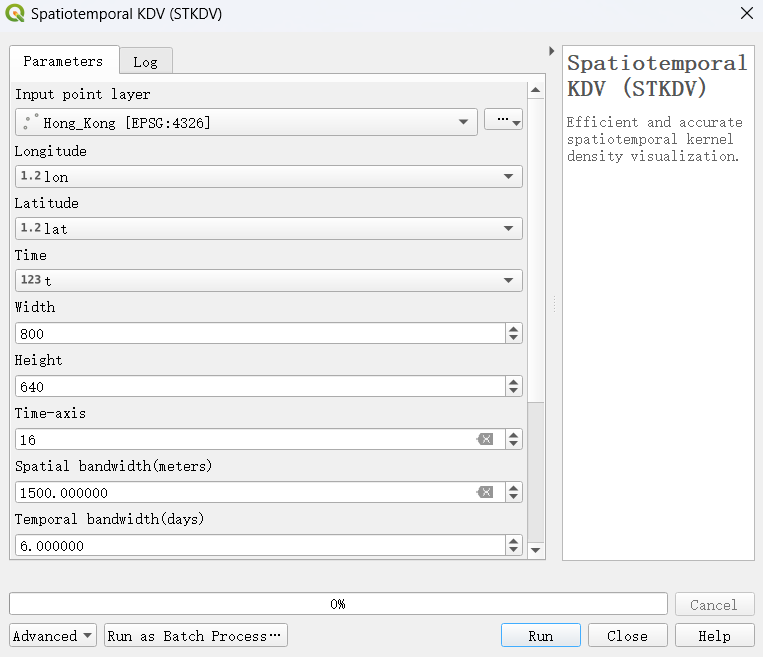
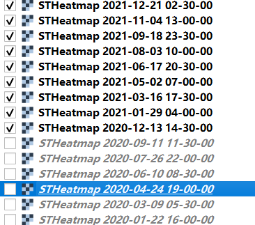
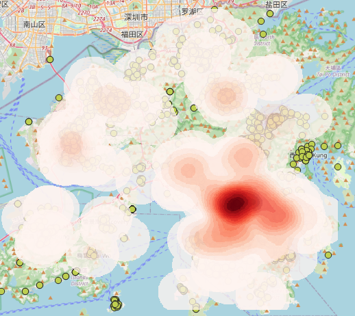

# Fast Density Analysis

A Powerful QGIS plug-in for Large-scale Geospatial Analytics

Unlock the power of large-scale geospatial analysis - with our QGIS plugin, quickly generate high-resolution kernel density visualizations, supporting advanced analysis tasks such as bandwidth-tuning and spatiotemporal analysis. No matter how large your dataset, our plugin delivers efficient and accurate results. Download now and start a new chapter in your geospatial analysis journey!

Power by [LibKDV](https://github.com/libkdv/libkdv) - The fastest library in the world.

## KDV

Efficient and accurate kernel density visualization.

Result heatmap:

## STKDV

Efficient and accurate spatiotemporal kernel density visualization.

Result Spatiotemporal heatmaps:

