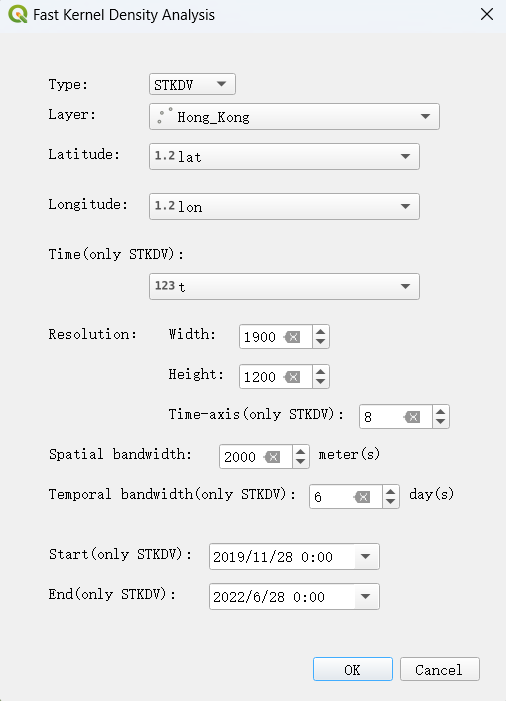
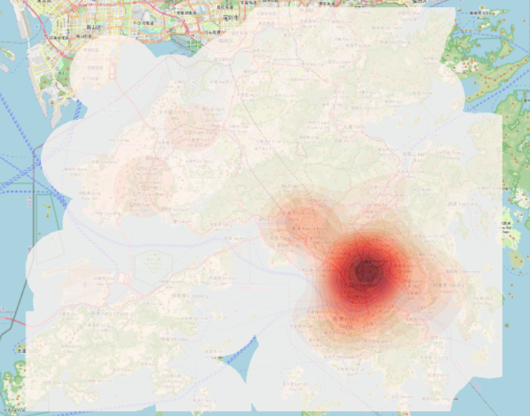
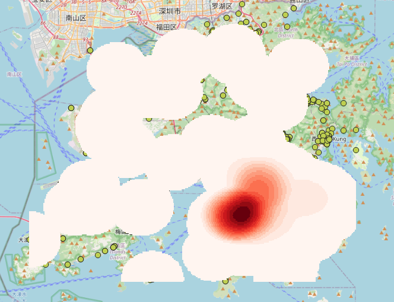

# Fast Kernel Density Analysis

A Powerful QGIS plug-in for Large-scale Geospatial Analytics

Kernel Density Visualization (KDV) has been extensively used for many geospatial analysis tasks (Heatmap). Some representative examples include traffic accident hotspot detection, crime hotspot detection, and disease outbreak detection. Although many scientific software packages, including Scipy, Statmodels, and Scikit-learn, geographical software packages, including QGIS and ArcGIS, and visualization software packages, including Deck.gl and KDV-Explorer, can also support KDV, none of these tools, to the best of our knowledge, can be scalable to high resolution size (e.g., 1280 x 960) and large-scale datasets (e.g., one million data points). Therefore, the huge computational cost limits the applicability of using the off-the-shelf software tools to support advanced (or more complex) geospatial analytics, e.g., bandwidth-tuning analysis and spatiotemporal analysis, which involves computing multiple KDVs in one batch.

Power by [libkdv/libkdv (github.com)](https://github.com/libkdv/libkdv)

### Demo

#### KDV

#### STKDV

